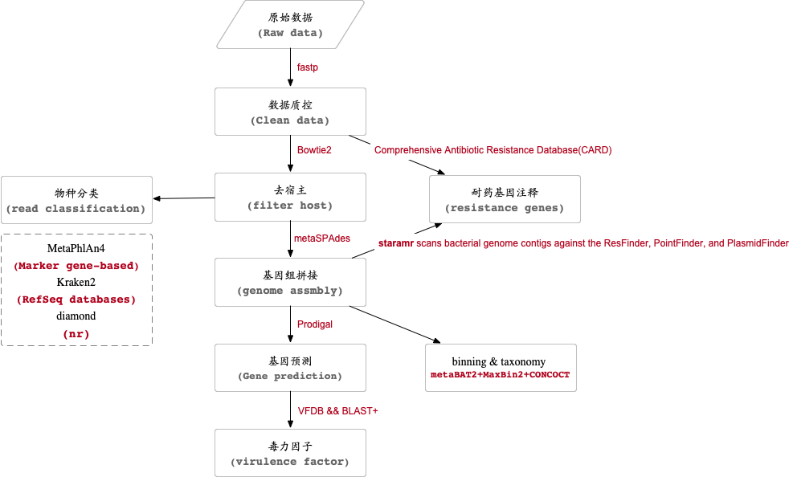

# User guide

step1: build your own local Docker image based on the image file.
```{.cs}
cd Docker
docker build -t meta ./
```
or
```{.cs}
docker pull fanyucai1/meta:latest
```

step2: Download database
```{.cs}
mkdir -p /ref/ 
################host bowtie2 index(https://bowtie-bio.sourceforge.net/bowtie2/index.shtml)
mkdir -p /ref/bowtie2
cd /ref/bowtie2
wget https://genome-idx.s3.amazonaws.com/bt/grch38_1kgmaj_snvindels_bt2.zip #https://github.com/BenLangmead/bowtie-majref   GRCh38 + major SNP-and-indels
unzip grch38_1kgmaj_snvindels_bt2.zip

################kraken2 database(https://benlangmead.github.io/aws-indexes/k2)
mkdir -p /ref/kraken2/
cd /ref/kraken2/
wget https://genome-idx.s3.amazonaws.com/kraken/k2_pluspfp_20240605.tar.gz #Standard plus Refeq protozoa, fungi & plant
tar xzvf k2_standard_20240605.tar.gz

################CARD Reference Data(https://github.com/arpcard/rgi)
mkdir -p /ref/card/
cd /ref/card/
wget https://card.mcmaster.ca/latest/data && tar -xvf data ./card.json && rm -rf data
wget -O wildcard_data.tar.bz2 https://card.mcmaster.ca/latest/variants
mkdir -p wildcard
tar -xjf wildcard_data.tar.bz2 -C wildcard
gunzip wildcard/*.gz
docker run -v /ref/card:/ref/ meta sh -c 'cd /ref/ && /opt/conda/envs/rgi/bin/rgi card_annotation -i /ref/card.json'
# get version info from https://card.mcmaster.ca/download
docker run -v /ref/card:/ref/ meta sh -c 'cd /ref/ && /opt/conda/envs/rgi/bin/rgi wildcard_annotation -i wildcard --card_json /ref/card.json -v 4.0.2'

################staramr(https://github.com/phac-nml/staramr)
cd /ref/
docker run -v /staging/fanyucai/metagenomics/ref/:/ref/ meta staramr db build --dir /ref/staramr/

################CheckM
mkdir -p /ref/CheckM
cd /ref/CheckM
wget https://zenodo.org/records/7401545/files/checkm_data_2015_01_16.tar.gz
tar xzvf checkm_data_2015_01_16.tar.gz

################metaphlan
mkdir -p /ref/metaphlan
cd /ref/metaphlan
wget http://cmprod1.cibio.unitn.it/biobakery4/metaphlan_databases/mpa_vJan25_CHOCOPhlAnSGB_202503.tar
wget http://cmprod1.cibio.unitn.it/biobakery4/metaphlan_databases/bowtie2_indexes/mpa_vJan25_CHOCOPhlAnSGB_202503_bt2.tar
tar xvf mpa_vJan25_CHOCOPhlAnSGB_202503.tar
tar xvf mpa_vJan25_CHOCOPhlAnSGB_202503_bt2.tar

################ VFDB
mkdir -p /ref/VFDB
wget https://www.mgc.ac.cn/VFs/Down/VFDB_setB_pro.fas.gz
docker run -v /share/metagenomics/ref/VFDB/:/ref meta sh -c 'export PATH=/opt/conda/envs/rgi/bin:$PATH && cd /ref/ && makeblastdb -in VFDB_setB_pro.fas -dbtype prot -out VFDB_setB_pro'

################GTDB-Tk reference data(https://ecogenomics.github.io/GTDBTk/installing/index.html#)
mkdir -p /ref/gtdbtk
wget https://data.ace.uq.edu.au/public/gtdb/data/releases/release226/226.0/auxillary_files/gtdbtk_package/full_package/gtdbtk_r226_data.tar.gz

```

# Flowchart

